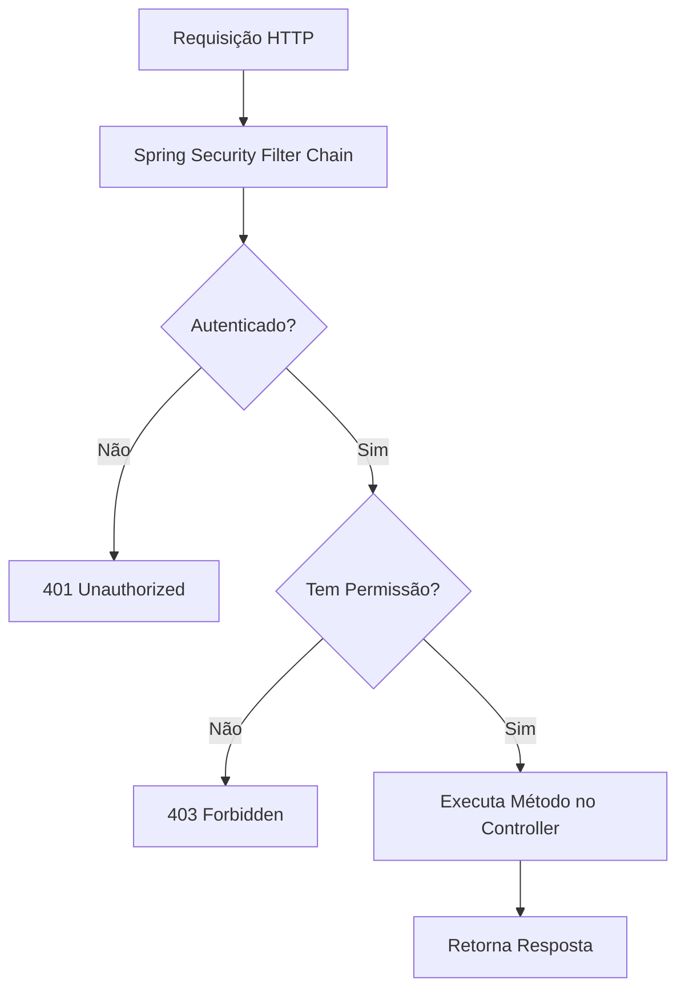

# Spring Security Method-Level Demo

Este projeto demonstra como aplicar segurança em nível de método usando Spring Security com @EnableMethodSecurity e restrições baseadas em roles (ADMIN e USER).
Inclui testes automatizados com MockMvc e usuários mockados para validar o acesso.

## 📌 Objetivos

- Ativar segurança em nível de método no Spring Boot.
- Restringir operações a roles específicas:
   - Somente ADMIN pode criar produtos.
   - Somente USER autenticado pode listar produtos.
- Implementar testes de segurança para validar o comportamento.

## 📂 Estrutura de Pastas

```text
spring-security-method-demo/
├── src/
│   ├── main/
│   │   ├── java/com/example/securitymethod/
│   │   │   ├── SecurityConfig.java
│   │   │   ├── ProductService.java
│   │   │   ├── ProductController.java
│   │   │   └── SpringSecurityMethodDemoApplication.java
│   │   └── resources/application.properties
│   └── test/
│       ├── java/com/example/securitymethod/
│       │   └── ProductControllerTest.java
│       └── resources/application-test.properties
├── build.gradle.kts
└── README.md
```

## ⚙️ Configuração de Segurança

## 📊 Fluxo de Autorização



