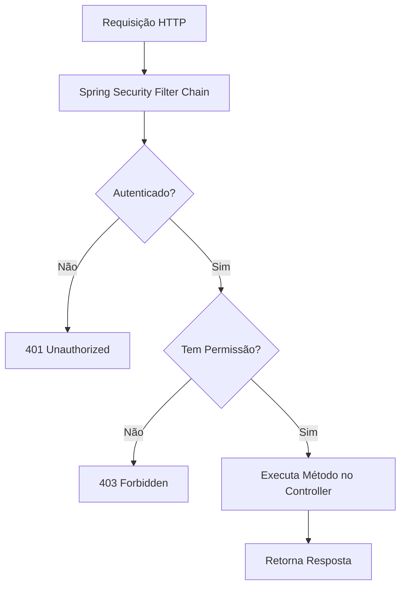

# Spring Security Method-Level Demo

## 📂 Estrutura de Pastas

```text
spring-security-method-demo/
├── src/
│   ├── main/
│   │   ├── java/com/example/securitymethod/
│   │   │   ├── SecurityConfig.java
│   │   │   ├── ProductService.java
│   │   │   ├── ProductController.java
│   │   │   └── SpringSecurityMethodDemoApplication.java
│   │   └── resources/application.properties
│   └── test/
│       ├── java/com/example/securitymethod/
│       │   └── ProductControllerTest.java
│       └── resources/application-test.properties
├── build.gradle.kts
└── README.md
```

## 📊 Fluxo de Autorização



