# Spring Security Method-Level Demo

## 📂 Estrutura de Pastas

```text
spring-security-method-demo/
├── src/
│   ├── main/
│   │   ├── java/com/example/securitymethod/
│   │   │   ├── SecurityConfig.java
│   │   │   ├── ProductService.java
│   │   │   ├── ProductController.java
│   │   │   └── SpringSecurityMethodDemoApplication.java
│   │   └── resources/application.properties
│   └── test/
│       ├── java/com/example/securitymethod/
│       │   └── ProductControllerTest.java
│       └── resources/application-test.properties
├── build.gradle.kts
└── README.md
```

## 📊 Fluxo de Autorização

```mermaid
flowchart TD
    A[Requisição HTTP] --> B[Spring Security Filter Chain]
    B --> C{Autenticado?}
    C -- Não --> D[401 Unauthorized]
    C -- Sim --> E{Tem Permissão?}
    E -- Não --> F[403 Forbidden]
    E -- Sim --> G[Executa Método no Controller]
    G --> H[Retorna Resposta]

```



